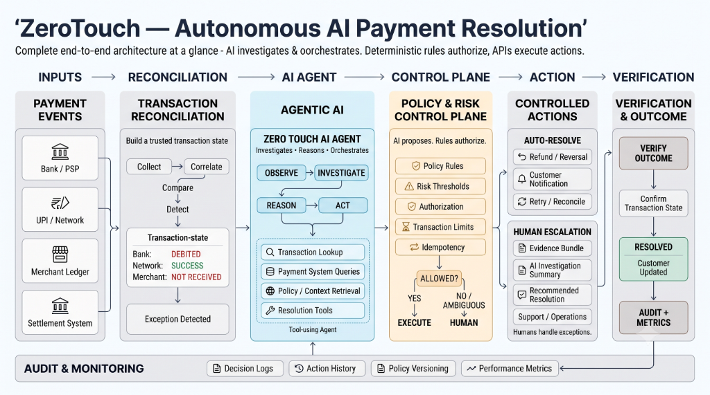

# ZeroTouch AI: Proactive Payment Resolution



Payment failures in India's UPI ecosystem routinely land in ambiguous states — debited but unconfirmed, pending too long, or reported inconsistently across the bank, payment network, merchant, and settlement ledger. Today, resolving these exceptions requires a customer to notice the problem, raise a complaint, and wait while support staff manually cross-check multiple systems, even when the underlying issue is technically resolvable within seconds.

**ZeroTouch is an autonomous AI teammate that closes this gap before a support ticket is ever created.**

Customer support for consumer payments shouldn't be about closing tickets faster—it should be about *tickets avoided*. At India's current UPI volume of 24.51 billion monthly transactions, even a small share of exceptions represents a massive operational burden. ZeroTouch connects investigation, decision, action, and verification into a single autonomous loop, positioning it as a resolution layer that sits on top of existing payment infrastructure rather than replacing it.

---

## The Five-Stage Autonomous Loop

ZeroTouch follows a strict, five-stage loop (Detect, Investigate, Reason, Act, Verify) to manage payment exceptions autonomously:

1. **Detect (Reconciliation Watcher):** Continuously ingests transaction events. When a transaction lands in a failure or ambiguous state, the AI springs into action.
2. **Investigate (Data Collection):** Gathers evidence across Bank, Network (NPCI), Merchant, and Settlement ledgers.
3. **Reason (AI Agent):** An LLM agent (powered by Gemini) reasons over the evidence to determine the root cause and generate a clear investigation narrative.
4. **Act (Policy & Action):** 
   - **Clear-cut (Auto-Resolve):** If the case is safe and eligible under policy, the system autonomously executes a refund or reversal. **No ticket is ever created.**
   - **Ambiguous (Human Escalation):** If a case falls outside its authorization (e.g., suspected fraud, high-value outlier), it hands off to a human agent with a complete investigation summary, transaction evidence, and a suggested resolution, replacing a blank ticket with an already-investigated one.
5. **Verify:** Independently confirms the transaction state post-action and proactively messages the customer with the status.

**Security & Control:** The system is built on a policy-and-risk control plane that restricts autonomous action. The AI investigates and reasons, but **only pre-authorized, deterministic rules can approve money movement**, ensuring strict auditability at every step.

---

## Technical Architecture

The **target production architecture** utilizes LangGraph for stateful orchestration, a RAG-based knowledge layer for policies and SOPs, backed by PostgreSQL and full audit logging.

**This Prototype** demonstrates the core loop and consists of:
- **Backend:** Python / FastAPI. It manages the orchestration, AI reasoning (Gemini API with tool calling), policy engine, and simulated API ledgers.
- **Frontend:** React.js / Tailwind CSS. It provides a real-time operations dashboard visualizing the agent's timeline, the generated narrative, and the final resolution.

---

## Test Scenarios

The prototype mocks three specific scenarios to demonstrate the platform's decision-making capabilities:
* **TX9281 (Clear-cut Auto-Reversal):** A low-risk payment where the customer was debited but the merchant was not credited. The system safely executes an autonomous reversal.
* **TX9342 (Ambiguous Escalation):** A high-risk, high-value transaction with conflicting network states. The system safely halts and escalates to a human agent, providing the investigation narrative as context.
* **TX9410 (No Action):** A successfully settled and consistent transaction across all 4 ledgers. No action is taken.

---

## Running the Prototype locally

You will need two terminal windows to run both the FastAPI backend and the React frontend.

### 1. Backend Setup (FastAPI)
1. Create a `.env` file inside the `backend/` directory and add your Gemini API key (see `backend/.env.example`).
   ```env
   GEMINI_API_KEY=your_api_key_here
   ```
2. Install dependencies:
   ```bash
   pip install -r backend/requirements.txt
   ```
3. Start the backend server (from the root directory):
   ```bash
   python -m uvicorn backend.main:app --host 0.0.0.0 --port 8000
   ```

### 2. Frontend Setup (React/Vite)
1. Navigate to the frontend directory:
   ```bash
   cd frontend
   ```
2. Install dependencies:
   ```bash
   npm install
   ```
3. Start the frontend development server:
   ```bash
   npm run dev
   ```
4. Open the displayed `localhost` URL (usually `http://localhost:3000` or `5173`) in your browser to interact with the dashboard.
