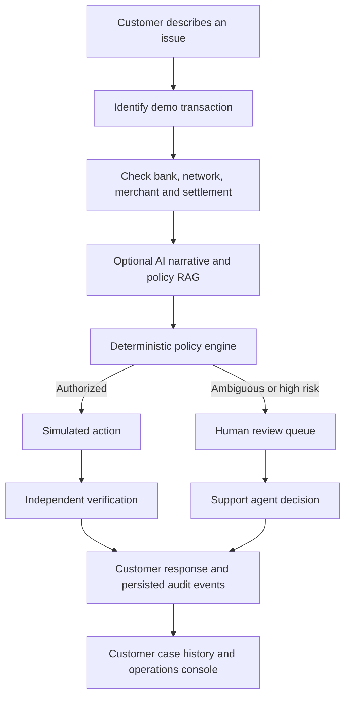

# ZeroTouch

**Your autonomous payment teammate.** From issue to resolution, with an auditable trail and a person involved when policy requires it.

Payment exceptions often leave customers waiting while support staff compare bank, network, merchant, and settlement records. ZeroTouch demonstrates how an AI teammate can investigate those records, apply deterministic financial policy, take a permitted simulated action, verify the result, and explain what happened.

> This is a hackathon prototype. All payment records and money movement are fictional simulations; it is not connected to Paytm or a real bank.

## How it works


```mermaid
flowchart TD
    C[Customer describes an issue] --> I[Identify demo transaction]
    I --> T[Check bank, network, merchant and settlement]
    T --> A[Optional AI narrative and policy RAG]
    A --> P[Deterministic policy engine]
    P -->|Authorized| X[Simulated action]
    X --> V[Independent verification]
    P -->|Ambiguous or high risk| H[Human review queue]
    V --> N[Customer response and persisted audit events]
    H --> D[Support agent decision]
    D --> N
    N --> O[Customer case history and operations console]
```

The LLM can investigate and explain evidence, but it cannot authorize financial actions. The Python policy engine evaluates transaction state, risk, amount, and prior refund status before the workflow can take action.

For employee requests, the Supervisor supplies Grok with a bounded registry of function schemas through the xAI Responses API. The backend validates arguments and runs each function locally against SQLAlchemy operations; Grok never receives a SQL console or direct database handle. The tool loop is bounded, business actions are audited, and missing/failed optional AI calls fall back to deterministic workflows. See [xAI function calling](https://docs.x.ai/developers/tools/function-calling) for provider setup details.

## Features

- Three role choices: Customer, Employee, and Admin, with role-bound server sessions.
- Customer assistant with starter prompts, recent transactions, support cases, and persisted chat history.
- Existing LangGraph workflow and simulated bank, network, merchant-ledger, and settlement tools.
- Deterministic policy decisions for automatic reversal, refund SLA chase, bounced refund, settlement explanation, and escalation.
- Reversal verification, simulated customer notifications, human approval/rejection, and audit events.
- Support command center with transaction investigations, evidence, agent trace, and human-review queue.
- Customer data endpoints are separate from support endpoints; support APIs reject customer sessions.
- Employee workspace with one Ask ZeroTouch chat, department specialist navigation, persisted conversations, task timeline, agent activity, and verified tool results.
- Cross-department onboarding, employee directory, IT access requests, training assignments, leave, expenses, support tickets, reports, knowledge search, and audit logging.
- Optional Grok function calling through the xAI Responses API. Grok can only invoke the server's registered business tools; financial actions still pass through deterministic policy and the Action Gateway.
- Optional Gemini narrative/tool calling and RAG for the payment support experience. Deterministic fallbacks are available when API keys are not configured.

## Technology

- **Frontend:** React 18, Vite, Tailwind CSS, Lucide icons.
- **Backend:** Python, FastAPI, LangGraph, SQLAlchemy.
- **Storage:** SQLite by default; PostgreSQL can be configured with `DATABASE_URL`.
- **Optional AI:** Grok through `XAI_API_KEY` for employee requests and Google Gemini through `GEMINI_API_KEY` (or `GOOGLE_API_KEY`) for payment support.

## Run locally

From the repository root, open two terminals.

### Backend

```powershell
py -3 -m venv .venv
.venv\Scripts\Activate.ps1
python -m pip install -r backend\requirements.txt
python -m uvicorn backend.main:app --host 127.0.0.1 --port 8000 --reload
```

Copy `backend/.env.example` to `backend/.env` to configure optional model keys. Set `XAI_API_KEY` to enable Grok in the employee workspace; `XAI_MODEL` defaults to `grok-4.7`. Set `GEMINI_API_KEY` (or `GOOGLE_API_KEY`) to enable Gemini for payment support. The employee workspace and payment workflows retain deterministic fallbacks without model keys. Do not commit `.env` files.

### Frontend

```powershell
cd frontend
npm ci
npm run dev
```

Open `http://localhost:3000`. Vite proxies `/api` requests to the backend on port 8000.

## Demo accounts

| Workspace | Email | Password |
| --- | --- | --- |
| Customer | `ayush@zerotouch.demo` or `vansh@zerotouch.demo` | `demo123` |
| Employee | `employee@zerotouch.demo` or `hr@zerotouch.demo` | `demo123` |
| Admin | `admin@zerotouch.demo` or `support@zerotouch.demo` | `demo123` |

Sessions and roles are held server-side. Customer transaction, case, message, ticket, and refund reads are scoped to the signed-in customer. Employees enter one workspace and can select a department bot from its navigation; they do not need separate department logins. Admin dashboard, manager approvals, skill publishing, reset, and kill-switch actions require an admin account.

The seeded tenant includes 24 customers, 24 employees, 8 departments, 58 transactions, 10 refunds, 20 support tickets, 15 expenses, 15 leave requests, 12 IT tickets, 12 access requests, 10 onboarding plans, 12 training modules, 24 training assignments, 10 knowledge documents, 12 sales leads, 10 campaigns, 16 tasks, and 30 audit records. Records are fictional and linked by stable demo identifiers.

Employee requests can be sent to `POST /api/assistant` with `{ "message": "...", "department": "all" }`. An optional `conversation_id` continues a saved conversation. Retrieve owned conversation history and its latest task using `GET /api/assistant/conversations/{conversation_id}`. Both routes require an Employee session.

Try these in the Employee workspace:

- “Onboard Rahul Sharma into Finance” — HR, department training, IT access, Knowledge, and manager work are coordinated; IT remains pending approval.
- “Show failed payments above ₹10,000” — returns database-backed failed-payment records.
- “Create an IT access request for Priya” — creates a least-privilege request pending manager approval.
- “Prepare today’s support report” or “What is the refund policy?”
- In the Sales bot: “Find leads at Northstar Retail” or “Create a follow-up task.”
- In the Marketing bot: “Show campaign performance” or “Summarize customer segments.”

## Demo scenarios

- **TX9281 — safe reversal:** ₹2,500 debit, merchant not credited, low risk, no prior refund. The deterministic policy permits a simulated reversal and the workflow verifies it.
- **TX9342 — human review:** ₹18,000, unresolved network state, high risk. Automatic action is blocked and the case is escalated.
- **RF202 — refund SLA:** overdue refund triggers a simulated bank follow-up.
- **RF204 — refund bounced:** invalid destination routes to the wallet-credit demo action.
- **S301 — settlement explanation:** ₹10,000 gross, ₹300 platform fee, ₹50 GST, and ₹9,650 net.
- **S302 — settlement explanation:** a simulated ₹50,000 settlement is itemized as ₹1,000 fees and ₹49,000 net.
- **S306 — compliance hold:** high-risk KYC hold is escalated; funds are not autonomously released.

Suggested three-minute walkthrough: sign in as Ayush and ask about the ₹2,500 debit; review the evidence and verified action and open My Refunds; try the ₹9,650 settlement question; sign out and enter the employee workspace to prepare a support report; then enter the admin workspace to inspect the TX9281 audit trace and TX9342 human-review queue.

## API overview

- `POST /api/auth/login`, `GET /api/auth/me`, `POST /api/auth/logout`
- Customer: `GET /api/customer/profile`, `/transactions`, `/cases`, `/messages`, `/refunds`; `POST /api/chat`, `/api/refunds/create`, `/api/tickets`
- Refunds and support: `GET /api/refunds/{refund_id}`, `GET /api/tickets`
- Employee assistant: `POST /api/assistant`, `GET /api/assistant/conversations/{conversation_id}`
- Workforce: `/api/workforce/tasks`, `/api/workforce/command`; admin-only `/api/admin/enterprise-overview`, `/api/workforce/dashboard`, `/api/workforce/reset`, `/api/workforce/governor/kill-switch`, `/api/workforce/skills/publish`
- Support: `GET /api/transactions`, `GET /api/resolutions/{id}/events`, `POST /api/resolutions/{id}/run`, `POST /api/resolutions/{id}/human-decision`, `GET /api/admin/dashboard`, `/review-queue`, `/audit-logs`
- Integration demo: `POST /api/webhook/npci`

Customer-initiated and employee-assisted reversals go through deterministic eligibility rules and the Action Gateway, then persist a refund record only after verification and append a customer-visible notification event. Repeated refund requests return the existing record. Employee conversations, tasks, support tickets, finance records, onboarding steps, and tool audits are stored in the database. The admin console provides an overview and entity tables; legacy review, finance, capacity, academy, and skill tools remain available under “Additional tools.” Unsupported requests return `NEEDS_INPUT` instead of claiming completion.

Backend acceptance checks can be run with `python -m unittest backend.tests.test_product_flows -v` from the repository root.

## Prototype limits

- Demo accounts are hard-coded and sessions are held in memory; signing out or restarting the backend invalidates them.
- Ledgers, refunds, wallet credits, SLA chases, and notifications are simulated. No real customer data or payment rails are used.
- The default SQLite store is local to the working directory. Configure `DATABASE_URL` for a PostgreSQL instance.
- Grok requires `XAI_API_KEY` and network access; without it, the employee workspace uses deterministic demo workflows. Payment support RAG and Gemini tool calling require a configured Gemini key; policy authorization remains deterministic either way.
- This demo does not implement production identity verification, account ownership, rate limiting, or a production webhook secret. Do not deploy it as-is.
